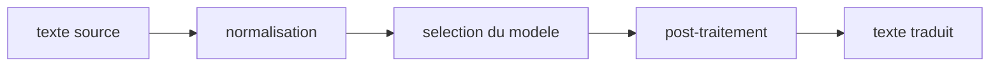
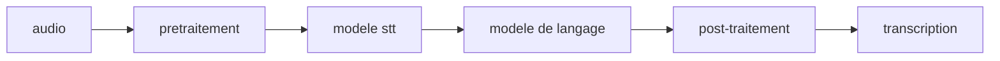

# machine translation stack

Cette note expose notre approche pour un systeme de traduction couvrant le francais et le moore. L'objectif est de rester opensource, modulaire et realiste pour une equipe reduite.

## objectifs du systeme

- text-to-text: traduction bidirectionnelle entre francais et moore.
- speech-to-text: transcription des audios francais et moore.
- text-to-speech: generation de parole naturelle en moore.

Les ressources etiquetees restent rares, d'ou l'obligation de miser sur le transfert d'apprentissage et la quantification.

## text to text

### modeles a privilegier

- [`nllb-200`](https://ai.meta.com/research/no-language-left-behind/) pour la couverture des langues peu dotees.
- [`mbart-50`](https://arxiv.org/abs/2001.08210) comme base polyvalente facile a affiner.
- [`m2m-100`](https://arxiv.org/abs/2010.11125) pour eviter un pivot par l'anglais.
- [`marianmt`](https://github.com/Helsinki-NLP/Opus-MT) lorsque l'on cherche un modele compacte.
- `mistral 7b` ou autres `llm` legers apres quantification `int4`.

### ameliorations cibles

- constitution d'un corpus parallele francais-moore et fine tuning specifique.
- back translation pour augmenter artificiellement la portion moore.
- couches `adapter` pour personnaliser sans toucher a tous les poids.
- auto etiquetage via notre pipeline `stt` pour produire du parallele low-cost.

### mesures de qualite

- `bleu` et `chrf++` pour suivre les progres.
- evaluation humaine par nos locuteurs natifs.
- suivi de la latence pour garantir une inference acceptable sur `a4000` ou `a6000`.

## speech to text

### options de modele

- [`whisper`](https://openai.com/research/whisper) adapte au moore apres un leger affinement.
- [`wav2vec 2.0`](https://arxiv.org/abs/2006.11477) pour profiter de l'apprentissage auto supervise.
- architectures `conformer` lorsque l'on veut pousser la precision.

### collecte et augmentation

- campagnes de crowdsourcing dans les communautes partenaires.
- generation synthetique avec modification de vitesse, hauteur ou bruit.
- augmentation phonemique pour couvrir les variantes dialectales.

### suivi de performance

- `wer` comme indicateur principal.
- `per` pour surveiller les confusions phonemiques.
- `rtf` pour garantir une inference proche du temps reel.

## text to speech

### modeles candidats

- [`tacotron 2`](https://arxiv.org/abs/1712.05884) pour la qualite vocale.
- [`fastspeech 2`](https://arxiv.org/abs/2006.04558) pour la rapidite.
- [`vits`](https://arxiv.org/abs/2106.06103) quand on veut un pipeline de bout en bout.

### leviers de progression

- adaptation par locuteur a partir de corpus moore collectes localement.
- modelisation de la prosodie pour un rendu expressif.
- augmentation avec perturbations audio et representations phonemiques.

### metriques clefs

- `mos` obtenu via ecoutes internes.
- `mcd` pour suivre la qualite spectrale.
- `cer` afin d'assurer l'intelligibilite.

## integration pipeline

### traduction ecrite

### chaine voix

## defis a surveiller

- penurie de donnees moore etiquetees.
- variabilite dialectale entre regions.
- contraintes de deploiement sur du materiel limite.
- besoin futur de support multimodal (texte, audio, visuel).

