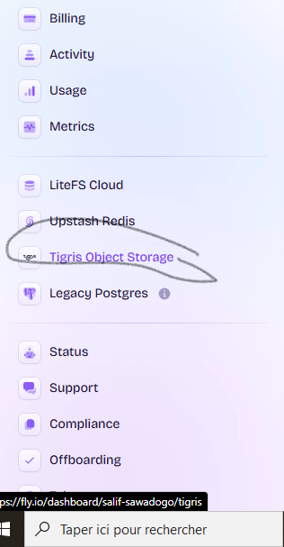
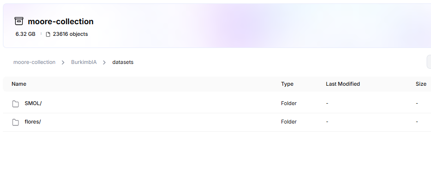
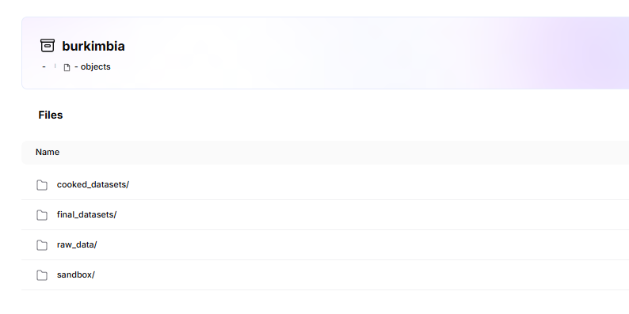

# Accessing and Storing Data in our stack

This guide provides a technical walkthrough for interacting with S3-compatible object storage, using **Flio S3** as a practical example. 
The principles and code snippets are generally applicable to other S3-compatible services like AWS S3.

## Prerequisites

Before you begin, ensure you have the following:

* **An S3-Compatible Storage Account:** You'll need an account with an S3-compatible storage provider. This guide uses Flio S3 as an example, but you can adapt it for other providers.
* **Access Credentials:** Obtain your `AWS_ACCESS_KEY_ID`, `AWS_SECRET_ACCESS_KEY`, and the `AWS_ENDPOINT_URL_S3` for your storage provider.
* **Python Installed:** Ensure you have Python 3 installed on your system.
* **Required Python Libraries:** Install the necessary libraries using pip:
    ```bash
    pip install boto3 s3fs python-dotenv pandas datasets
    ```
    * `boto3`: The AWS SDK for Python.
    * `s3fs`: A library that provides a file-like interface to S3.
    * `python-dotenv`: For loading environment variables from a `.env` file.
    * `pandas`: For working with data in a tabular format (CSV).
    * `datasets`: For interacting with datasets, particularly from Hugging Face.

## 1. Understanding S3 Buckets


Here's the corrected version with improved clarity and grammar:  

---

An **S3 bucket** is like a **top-level folder** in S3-compatible storage. It helps you **store and organize everything**—files, images, videos, datasets, and more. However, unlike regular folders, an S3 bucket is designed for **scalability, durability, and remote access**.  

Each object inside a bucket has a **unique key (path)**, just like files inside folders. But in S3, there are no actual "subfolders"—everything is stored in a **flat structure**, and folder-like organization is achieved through naming conventions (e.g., `project/images/photo.jpg`).  

Our bucket can be viewed directly on the site **Flio** at [Fly Storage](https://fly.storage.tigris.dev). Simply scroll down on the main page, select **Tigris Object Storage**, and access your data.  

 
 

Now, let’s navigate to a specific path and explore the stored data:  

  


So, now that we will store our data and files here, how can we push files directly to the bucket or read them?


## 2. Setting Up Access Credentials for Secure Interaction

To allow programmatic access to your S3 bucket, you'll need to configure access credentials. These are crucial for authentication and ensuring secure machine-to-machine communication.

### Essential Credentials

* `AWS_ACCESS_KEY_ID`: Your public identifier.
* `AWS_SECRET_ACCESS_KEY`: Your private secret key (keep this secure!).
* `AWS_ENDPOINT_URL_S3`: The specific service endpoint. For Flio S3, this is `https://fly.storage.tigris.dev`.

### Secure Storage with `.env` Files

It's highly recommended to store your credentials in a `.env` file in your root folder to prevent accidentally exposing them in your code.

```bash
# .env
AWS_ACCESS_KEY_ID=your_public_key_here
AWS_SECRET_ACCESS_KEY=your_secret_key_here
AWS_ENDPOINT_URL_S3=weareburkima.dev
```

You can load these credentials into your Python environment using the `python-dotenv` library:

```python
from dotenv import load_dotenv
import os

load_dotenv(".env")  # Load variables from .env
```

## 3. Configuring Your S3 Client

You can interact with S3-compatible storage using various libraries. Two popular options in Python are `boto3` (the AWS SDK) and `s3fs` (which provides a file system-like interface).

### Using `boto3` for Direct API Calls

`boto3` offers a comprehensive interface for interacting with S3.

```python
import boto3

access_key = os.getenv("AWS_ACCESS_KEY_ID")
secret_key = os.getenv("AWS_SECRET_ACCESS_KEY")
endpoint_url = os.getenv("AWS_ENDPOINT_URL_S3")

s3_client = boto3.client(
    "s3",
    aws_access_key_id=access_key,
    aws_secret_access_key=secret_key,
    endpoint_url=endpoint_url,
)
```

### Using `s3fs` for a File System Interface

`s3fs` allows you to interact with your S3 bucket as if it were a local file system, which can be convenient for certain operations.

```python
import s3fs

access_key = os.getenv("AWS_ACCESS_KEY_ID")
secret_key = os.getenv("AWS_SECRET_ACCESS_KEY")
endpoint_url = os.getenv("AWS_ENDPOINT_URL_S3")

fs = s3fs.S3FileSystem(
    key=access_key,
    secret=secret_key,
    endpoint_url=endpoint_url
)
```

## 4. Listing Files Within a Bucket

You'll often need to see what files are stored in your bucket. Here's how to do it with both `s3fs` and `boto3`.

### Listing with `s3fs`

```python
BUCKET_NAME = "burkimbia"
prefix = "optional/folder/prefix/"  # Optional: Filter files within a specific folder

try:
    files = fs.ls(f"{BUCKET_NAME}/{prefix}")
    print(f"Files in s3://{BUCKET_NAME}/{prefix}:")
    for file in files:
        print(file)
except Exception as e:
    print(f"Error listing files: {e}")
```

### Listing with `boto3`

```python
def list_s3_files(s3_client, bucket_name, prefix=""):
    files = []
    paginator = s3_client.get_paginator("list_objects_v2")
    try:
        for page in paginator.paginate(Bucket=bucket_name, Prefix=prefix):
            for obj in page.get("Contents", []):
                files.append(obj["Key"])
        return files
    except Exception as e:
        print(f"Error listing files: {e}")
        return []

BUCKET_NAME = "burkimbia"
prefix = "sandbox/raw_data/"

file_list = list_s3_files(s3_client, BUCKET_NAME, prefix)
print(f"Files in s3://{BUCKET_NAME}/{prefix}:")
for file in file_list:
    print(file)
```

## 5. Uploading Files to Your Bucket

To store data, you'll need to upload files to your S3 bucket.

```python
def upload_file_to_s3(s3_client, local_path, bucket_name, s3_key):
    if not os.path.exists(local_path):
        raise FileNotFoundError(f"Local file not found: {local_path}")
    try:
        s3_client.upload_file(local_path, bucket_name, s3_key)
        print(f"Uploaded '{local_path}' to s3://{bucket_name}/{s3_key}")
    except Exception as e:
        print(f"Error uploading '{local_path}': {e}")

BUCKET_NAME = "burkimbia"
local_file_path = "path/to/your/local_file.txt"
s3_object_key = "sandbox/cooked_data/uploaded_file.txt"

upload_file_to_s3(s3_client, local_file_path, BUCKET_NAME, s3_object_key)
```

## 6. Downloading Files from Your Bucket

Retrieving data from your S3 bucket is done by downloading files.

```python
def download_file_from_s3(s3_client, bucket_name, s3_key, local_path):
    os.makedirs(os.path.dirname(local_path), exist_ok=True)
    try:
        s3_client.download_file(bucket_name, s3_key, local_path)
        print(f"Downloaded 's3://{bucket_name}/{s3_key}' to '{local_path}'")
    except Exception as e:
        print(f"Error downloading 's3://{bucket_name}/{s3_key}': {e}")

BUCKET_NAME = "burkimbia"
s3_object_key = "path/to/your/file/in/s3.txt"
local_file_path = "path/to/save/downloaded_file.txt"

download_file_from_s3(s3_client, BUCKET_NAME, s3_object_key, local_file_path)
```

## 7. Reading and Writing Data Directly

Often, you'll want to read data directly from S3 into your applications without downloading it first, or write data directly to S3.

### Reading JSON with `s3fs`

```python
import json

BUCKET_NAME = "burkimbia"
s3_json_path = f"{BUCKET_NAME}/sandbox/cooked_data/data.json"

try:
    with fs.open(s3_json_path) as f:
        data = json.load(f)
        print("JSON Data:", data)
except Exception as e:
    print(f"Error reading JSON from {s3_json_path}: {e}")
```

### Reading and Writing CSV Data with Pandas

The `pandas` library can directly read and write CSV files from and to S3 using `s3fs` under the hood.

```python
import pandas as pd

BUCKET_NAME = "burkimbia"
s3_csv_path = f"{BUCKET_NAME}/sandbox/cooked_data/data.csv"
s3_parquet_path = f"{BUCKET_NAME}/sandbox/cooked_data/data.parquet"

# Reading CSV
try:
    df = pd.read_csv(
        s3_csv_path,
        storage_options={
            "key": access_key,
            "secret": secret_key,
            "client_kwargs": {"endpoint_url": endpoint_url}
        }
    )
    print("CSV Data:")
    print(df.head())
except Exception as e:
    print(f"Error reading CSV from {s3_csv_path}: {e}")

# Writing Parquet
try:
    df.to_parquet(
        s3_parquet_path,
        storage_options={
            "key": access_key,
            "secret": secret_key,
            "client_kwargs": {"endpoint_url": endpoint_url}
        }
    )
    print(f"Data written to {s3_parquet_path}")
except Exception as e:
    print(f"Error writing Parquet to {s3_parquet_path}: {e}")
```

### Integration with Hugging Face Datasets

The `datasets` library from Hugging Face can also interact with S3 for storing and loading datasets.

```python
from datasets import Dataset

BUCKET_NAME = "your-bucket-name"
s3_dataset_path = f"s3://{BUCKET_NAME}/golden/text_to_text"

try:
    # Assuming you have a Pandas DataFrame 'df'
    dataset = Dataset.from_pandas(df)
    dataset.save_to_disk(
        s3_dataset_path,
        storage_options={
            "key": access_key,
            "secret": secret_key,
            "client_kwargs": {"endpoint_url": endpoint_url}
        }
    )
    print(f"Hugging Face dataset saved to {s3_dataset_path}")

    # Load dataset from S3
    loaded_dataset = Dataset.load_from_disk(
        s3_dataset_path,
        storage_options={
            "key": access_key,
            "secret": secret_key,
            "client_kwargs": {"endpoint_url": endpoint_url}
        }
    )
    print("Loaded Hugging Face dataset:", loaded_dataset)

except Exception as e:
    print(f"Error interacting with Hugging Face dataset on {s3_dataset_path}: {e}")
```