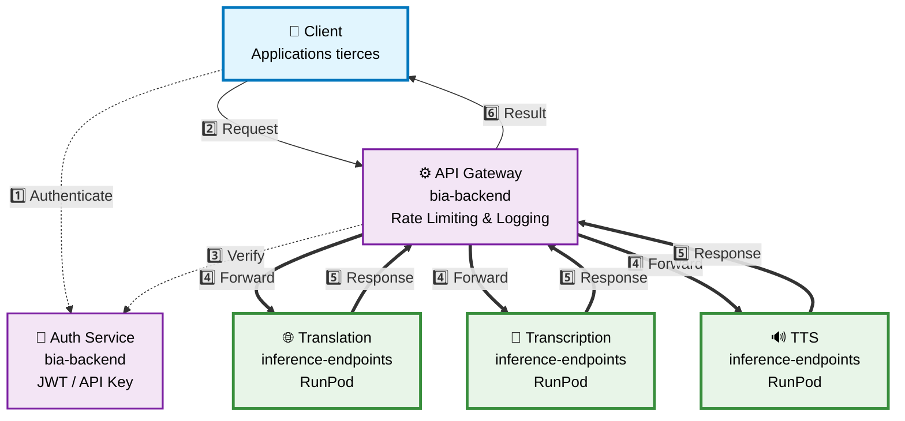
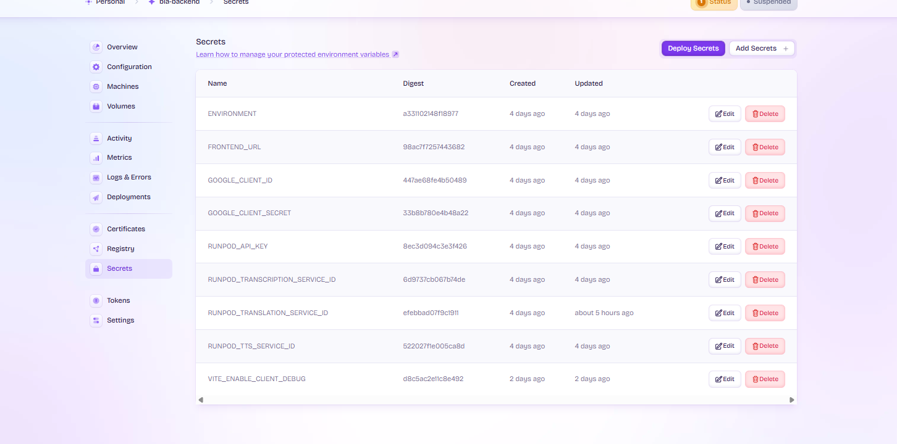
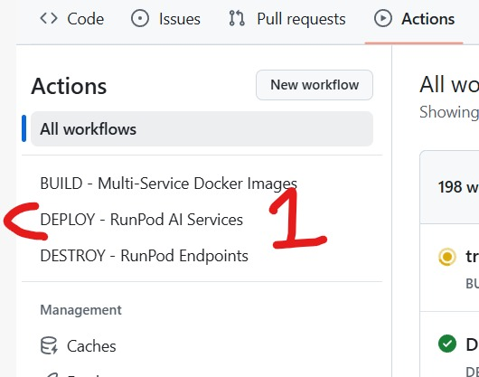
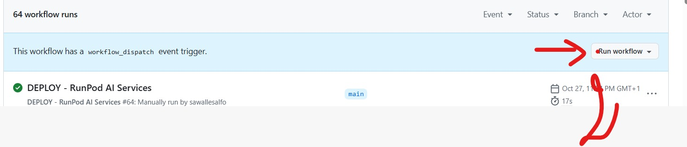
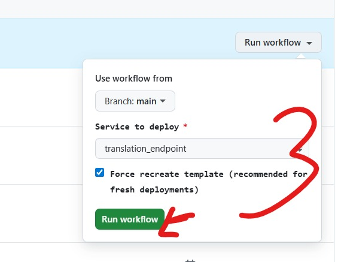
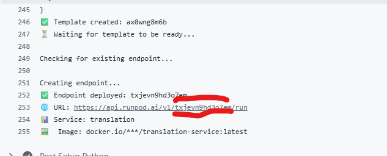
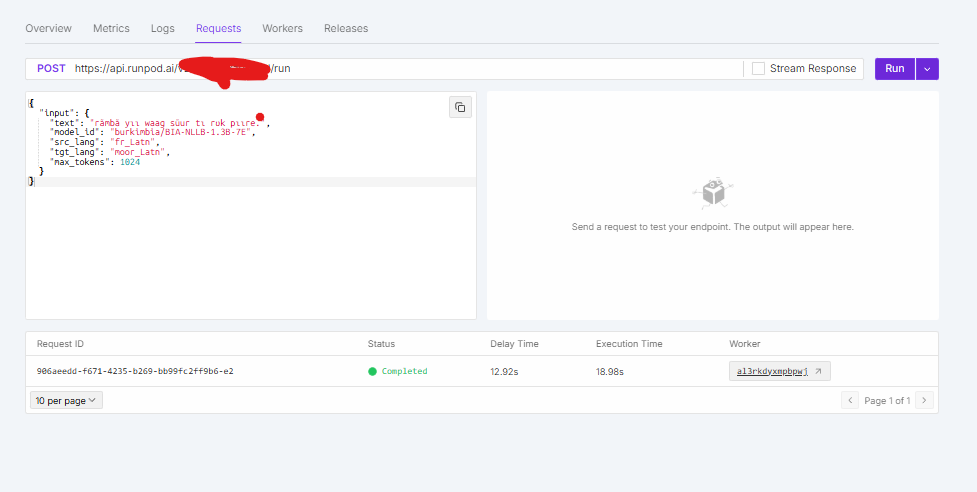

# Documentation API BurkimbIA - Services d'Inférence

## Repositories Importants

**Pour modifier nos API, vous devez connaître ces deux repositories :**

- **`inference-endpoints`** (prioritaire) : Contient les modèles et le code de déploiement sur RunPod
- **`bia-backend`** : API Gateway déployé sur Fly.io

⚠️ **Important** : Toute modification dans `inference-endpoints` doit être répercutée dans `bia-backend` si nécessaire.

---

## Architecture

<!-- L'infrastructure repose sur deux composants principaux :
- inference-endpoints : Repository contenant les modèles et le code pour les servir sur RunPod (serverless)
- bia-backend : Application FastAPI sur Fly.io qui gère l'authentification, la journalisation et le rate limiting -->





---

## Services et Modèles

<!-- Liste des modèles ML utilisés par service -->

| Service       | Modèle                               | Taille | Fonction                    |
|---------------|--------------------------------------|--------|-----------------------------|
| Translation   | `burkimbia/BIA-NLLB-600M-5E`         | 600M   | Traduction Français↔Mooré   |
| Translation   | `burkimbia/BIA-MISTRAL-7B-SACHI`     | 7B     | Traduction instruction-tuned|
| Transcription | `burkimbia/BIA-WHISPER-LARGE-SACHI_V2`| 1.5B  | Audio→Texte                 |
| TTS           | `burkimbia/BIA-SPARK-TTS-V2`         | 0.5B   | Texte→Audio                 |

---

## Déploiement sur RunPod

### Procédure

<!-- Étapes du déploiement manuel via l'interface RunPod -->

1. **Déployer l'image Docker** via l'interface RunPod



2. **Sélectionner l'option de service** appropriée



3. **Lancer la CI** et attendre le succès du build



4. **Vérifier le statut du worker** (passe de `initializing` à `idle`/`running`)


5. **Récupérer le service ID** depuis l'interface RunPod ou les logs CI




### Configuration

<!-- Le fichier runpod-config.json définit les endpoints, images Docker et ressources GPU -->

⚠️ **Après chaque déploiement** : Le service ID change. Mettre à jour les variables d'environnement dans `bia-backend`.

### Appel direct possible (mais non utilisé)

<!-- Il est techniquement possible d'appeler directement les endpoints RunPod -->

```bash
# Exemple d'appel direct RunPod (pour référence uniquement)
curl -X POST https://api.runpod.ai/v2/{endpoint_id}/run \
    -H 'Content-Type: application/json' \
    -H 'Authorization: Bearer TOKEN_RUNPOD' \
    -d '{
      "input": {
        "text": "Bonjour le monde",
        "model_id": "burkimbia/BIA-NLLB-1.3B-7E",
        "src_lang": "fr_Latn",
        "tgt_lang": "moor_Latn"
      }
    }'
```

**Problème** : RunPod fournit une seule API key pour tous les services, sans branding ni contrôle d'accès personnalisé.

**Solution** : C'est pourquoi nous utilisons `bia-backend` comme API Gateway, qui permet :
- Gestion multi-utilisateurs avec authentification
- Branding personnalisé (`api.burkimbia.com`)
- Rate limiting par utilisateur
- Logs et monitoring centralisés

---

## Utilisation via bia-backend

<!-- L'API Gateway est le point d'entrée recommandé pour tous les services -->

```bash
curl -X POST https://api.burkimbia.com/v1/translate \
  -H "Authorization: Bearer BIA_VOTRE_TOKEN" \
  -H "Content-Type: application/json" \
  -d '{
    "text": "Bonjour",
    "src_lang": "fr",
    "tgt_lang": "moore"
  }'
```

<!-- Les tokens JWT ou clés API sont obtenus via le backend -->

---

## Debugging

### Backend (bia-backend)

<!-- Utiliser Grafana pour les logs détaillés -->

Utiliser les logs **Grafana** sur Fly.io :
- URL : https://fly.io/apps/bia-backend/monitoring
- ⏱️ Le chargement prend du temps mais fournit des informations détaillées

### Services d'inférence (RunPod)

<!-- Aller dans Manage Serverless puis sélectionner le service -->

**Playground** : Tester les requêtes interactivement



**Logs** : Consulter les logs d'exécution


**Workers Status** : Vérifier l'état des workers

---

## Erreurs Courantes (GitHub Actions CI/CD)

### 1. Limite de workers dépassée

```bash
Checking for existing endpoint...
Creating endpoint...
❌ Error creating endpoint: 500 Server Error: Internal Server Error for url: https://rest.runpod.io/v1/endpoints
Response: {"error":"create endpoint: create endpoint: graphql: Max workers across all endpoints must not exceed your workers quota (5). Reduce the max workers for other endpoints or lower the max worker count for this endpoint to at most 0.","status":500}
```

**Cause** : Pour les comptes tiers comme le nôtre, nous sommes limités à 5 workers maximum.

**Solution** : Supprimer quelques workers existants sur RunPod avant de redéployer.

### 2. Template introuvable (service non prêt)

```bash
Checking for existing endpoint...
Creating endpoint...
❌ Error creating endpoint: 500 Server Error: Internal Server Error for url: https://rest.runpod.io/v1/endpoints
Response: {"error":"create endpoint: create endpoint: graphql: Unable to find template","status":500}
```

**Cause** : Le service n'est pas encore prêt sur RunPod.

**Solution** : Relancer simplement la CI de redéploiement.

---

## Authentification

<!-- Le backend supporte plusieurs modes d'authentification -->

- Email/mot de passe
- OAuth Google
- Clés API pour applications tierces