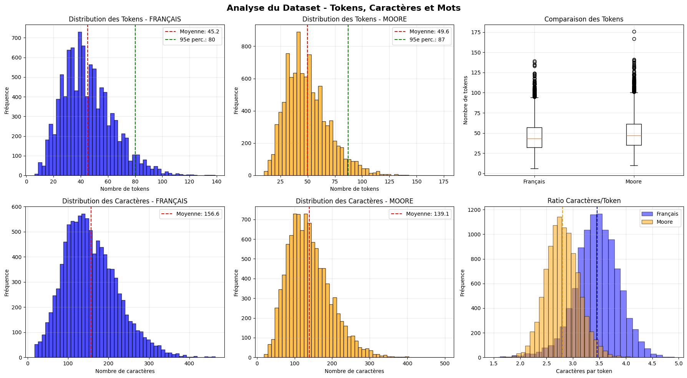

# Comment choisir le `max_length` pour l'entraînement de modèles ?

## Introduction

Dans l'entraînement de modèles de traitement du langage (traduction, fine-tuning, génération), il faut souvent fixer un paramètre important : `max_length`. Il représente la longueur maximale (en tokens) que le modèle accepte pour une séquence d'entrée ou de sortie.

Un `max_length` trop court peut tronquer du contenu utile ; un `max_length` trop long augmente fortement l'usage mémoire et ralentit l'entraînement. Ce guide explique une méthode simple pour choisir une valeur adaptée à votre dataset et à vos contraintes matérielles.

---

## Qu'est-ce qu'un token ?

Un token est l'unité de base utilisée par le tokenizer du modèle. Ce n'est ni un caractère strictement, ni forcément un mot entier :

- 1 token ≠ 1 caractère
- 1 token ≠ 1 mot

Exemples :

- « bonjour » → 1 token (mot fréquent)
- « intelligence » → peut être découpé en plusieurs tokens
- « ! » → 1 token

En pratique, pour la plupart des tokenizers BPE/WordPiece, on observe une approximation utile : 1 token ≈ 3–4 caractères (pour les langues latines). Ainsi, 128 tokens ≈ 400–500 caractères.

---

## Pourquoi le `max_length` est important ?

### Qualité

- Si `max_length` est trop faible, des exemples longs seront tronqués et le modèle perdra du contexte.
- Si `max_length` est trop élevé, on risque d'augmenter le bruit et de gaspiller des ressources.

### Ressources

La mémoire utilisée par un transformeur croît approximativement quadratiquement avec la longueur de séquence :

```
Mémoire ∝ (max_length)²
```

Exemples illustratifs :
- `max_length=128` → baseline
- `max_length=256` → ~4× mémoire
- `max_length=512` → ~16× mémoire

---

## Méthodologie : choix pragmatique

### Étape 1 — analyser les longueurs

Tokenisez votre corpus et calculez des statistiques (moyenne, médiane, percentiles, max).

```python
from transformers import AutoTokenizer
import numpy as np

tokenizer = AutoTokenizer.from_pretrained("votre-modele")
lengths = []
for text in your_dataset:
    enc = tokenizer(text, truncation=False)
    lengths.append(len(enc["input_ids"]))

print(f"Moyenne: {np.mean(lengths):.1f} tokens")
print(f"Médiane: {np.median(lengths):.1f} tokens")
print(f"95e percentile: {np.percentile(lengths, 95):.0f} tokens")
print(f"99e percentile: {np.percentile(lengths, 99):.0f} tokens")
print(f"Max: {max(lengths)} tokens")
```

### Étape 2 — choisir un percentile

Règle pratique : choisissez une valeur couvrant 95–99% des exemples. Les outliers (1–5%) ne doivent pas dicter la configuration si cela entraîne une explosion des ressources.

| Percentile 95 | max_length recommandé |
|---------------|-----------------------|
| ≤ 32 tokens   | 64                    |
| 33–64 tokens  | 128                   |
| 65–128 tokens | 256                   |
| 129–256 tokens| 512                   |
| > 256 tokens  | 1024 ou chunking      |

### Étape 3 — mesurer la couverture

```python
for max_len in [64, 128, 256, 512]:
    coverage = sum(1 for l in lengths if l <= max_len) / len(lengths) * 100
    print(f"max_length={max_len:3d} couvre {coverage:.1f}% des données")
```

Objectif : trouver la plus petite valeur couvrant au moins 95% des exemples.

### Étape 4 — prendre en compte le matériel

Voir les contraintes GPU typiques :

| GPU | max_length (batch=8) | max_length (batch=16) |
|-----|----------------------|------------------------|
| T4 (16GB) | 512 | 256 |
| V100 (32GB) | 1024 | 512 |
| A100 (40GB) | 2048 | 1024 |
| A100 (80GB) | 4096 | 2048 |



*Distribution des longueurs (extrait).* 

Astuce : combinez `gradient_accumulation_steps` et une réduction de `batch_size` pour utiliser un `max_length` plus grand sans dépasser la mémoire.

### Étape 5 — valider

- Mesurez le taux de troncature (exemples plus longs que `max_length`).

```python
truncated = sum(1 for l in lengths if l > max_length)
truncation_rate = truncated / len(lengths) * 100
print(f"Tronqués: {truncation_rate:.1f}% ({truncated} exemples)")
```

- Lancez un petit entraînement test pour vérifier l'utilisation mémoire et la perte/qualité.

---

## Cas pratique : traduction Français–Mooré

Exemple sur un corpus de 109 543 paires de phrases (tokenisation NLLB-200).

**Français (source)**
```
Moyenne: 45.2 tokens
Médiane: 42 tokens
95e perc.: 80 tokens
Max: 177 tokens
Caractères/token (moyenne): 3.46
```

**Mooré (cible)**
```
Moyenne: 49.6 tokens
Médiane: 47 tokens
95e perc.: 87 tokens
Max: 175 tokens
Caractères/token (moyenne): 2.80
```

Couverture observée :

| max_length | Couverture FR | Couverture MO |
|------------|---------------|---------------|
| 64         | 84.8%         | 79.5%         |
| 128        | 100.0%        | 99.8%         |
| 256        | 100.0%        | 100.0%        |

Remarque : Mooré a tendance à donner plus de tokens pour la même longueur en caractères (tokenizer découpe plus finement).

!!! note "recommandation"
  Pour ce dataset, `max_length = 128` est un bon compromis : couverture quasi complète et coût mémoire raisonnable.

---

## Bonnes pratiques

- Analysez toujours les longueurs de votre dataset avant de définir `max_length`.
- Visez 95–99% de couverture plutôt que 100%.
- Surveillez le taux de troncature pendant l'entraînement.
- Testez sur un petit run avant d'engager des ressources importantes.
- Pour gérer quelques outliers, préférez le chunking ou la rééchantillonnage plutôt que d'augmenter massivement le `max_length`.

## À éviter

- Ne choisissez pas une valeur arbitraire sans analyse (ex. « 128 parce que c'est courant »).
- N'optimisez pas pour les 1% d'exemples les plus longs si cela multiplie par 4/16 la mémoire.

---

## Conclusion

Le choix de `max_length` est un compromis entre couverture des données et efficacité mémoire. La méthode recommandée : analyser la distribution, choisir un percentile (95–99%), ajouter une petite marge, valider par des tests et ajuster si nécessaire.

Dans notre exemple Français–Mooré, `max_length = 128` fonctionne bien. Chaque corpus étant différent, répétez cette démarche pour vos propres données.